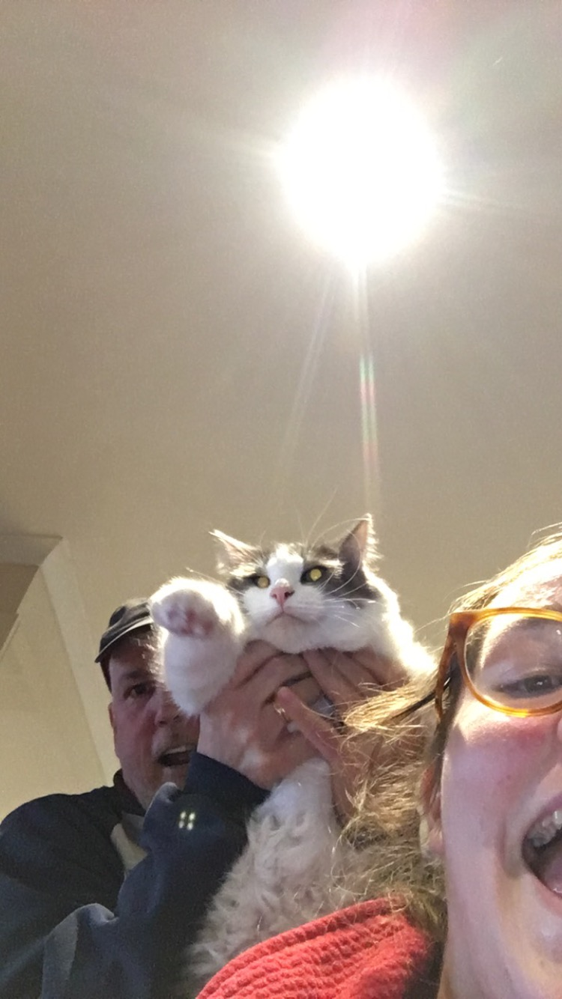

# Happy Father's Day!!

Thought I'd switch it up this time and give this a try. This is about the extent of my coding abilities, but maybe someday I'll send you a cool animated card that I've coded (I tried to copy someone else's but I could NOT figure out how to even change the girl's name to mine.) I hope you had a good day celebrated in classic Dan style - with some bacon for breakfast and a good book. Thanks for always sending me some uplifting Twitter content to restore a little faith in humanity for me, and for never failing to appreciate a cat video I show you. It's been really good to be back, even if I have to fend off your movie suggestions more often than usual.  

Anyways, click [here](https://dominion.games) to come lose your father's day game ;)

Love you more than Max loves being held up for photos! 

Mika

{width=30%}

*Edit
This was supposed to have some formatting in it to change the theme and stuff but I'm not sure why it didn't work.. Again, setting a low bar for future e-cards! ;)
